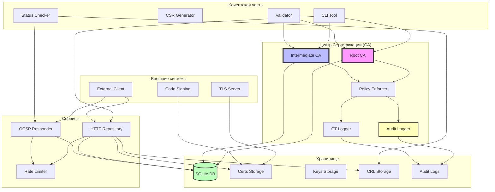

# MicroPKI - Минимальная инфраструктура публичных ключей

MicroPKI — это инструмент командной строки для создания и управления инфраструктурой публичных ключей (PKI) с поддержкой корневых и промежуточных центров сертификации, выпуска сертификатов различных типов, системой управления списками отзыва сертификатов (CRL), OCSP-ответчиком для проверки статуса сертификатов в реальном времени, а также полным набором клиентских инструментов для генерации CSR, запросов на выпуск сертификатов и проверки цепочек доверия.

## Содержание

- [Возможности](#возможности)
- [Архитектура системы](#архитектура-системы)
- [Быстрый старт](#быстрый-старт)
- [Установка](#установка)
- [Использование](#использование)
  - [Команды CA](#команды-ca)
  - [Команды аудита](#команды-аудита)
  - [Команды тестирования](#команды-тестирования)
  - [Клиентские команды](#клиентские-команды)
  - [Команды управления CRL](#команды-управления-crl)
  - [Команды OCSP](#команды-ocsp)
  - [Команды базы данных](#команды-базы-данных)
  - [Команды репозитория](#команды-репозитория)
- [Демонстрация](#демонстрация)
- [TLS Интеграция](#tls-интеграция)
- [Code Signing](#code-signing)
- [Политики безопасности](#политики-безопасности)
- [Система аудита](#система-аудита)
- [Certificate Transparency (CT)](#certificate-transparency-ct)
- [Rate Limiting](#rate-limiting)
- [Компрометация ключей](#компрометация-ключей)
- [Детекция аномалий](#детекция-аномалий)
- [Тестирование производительности](#тестирование-производительности)
- [CI/CD Pipeline](#cicd-pipeline)
- [Примеры](#примеры)
- [Структура проекта](#структура-проекта)
- [API Репозитория](#api-репозитория)
- [OCSP Responder API](#ocsp-responder-api)
- [Безопасность](#безопасность)
- [Тестирование](#тестирование)
- [Makefile команды](#makefile-команды)

## Возможности

### **Основные функции**
- **Генерация криптостойких ключей**:
  - RSA 2048 или 4096 бит
  - ECC P-256 или P-384
- **Создание самоподписанных X.509v3 сертификатов**
- **Создание промежуточных центров сертификации**
- **Выпуск сертификатов по шаблонам** (Server, Client, Code Signing, OCSP)
- **Поддержка Subject Alternative Names (SAN)**
- **Клиентские инструменты** (генерация CSR, запрос сертификатов, валидация)
- **Полная поддержка CRL версии 2 (v2)** согласно RFC 5280
- **OCSP-ответчик**
- **SQLite база данных** для хранения сертификатов
- **HTTP репозиторий** для распространения сертификатов и CRL
- **Аудит с криптографической целостностью**
- **Детекция аномалий**
- **Полная интеграционная демонстрация**

## Архитектура системы



**Компоненты системы:**
- **Root CA**: Корневой центр сертификации (самоподписанный)
- **Intermediate CA**: Промежуточный УЦ (подписан Root CA)
- **Policy Enforcer**: Применяет политики безопасности (размеры ключей, сроки, SAN)
- **Audit Logger**: Ведет NDJSON журнал с SHA-256 хеш-цепочкой
- **CT Logger**: Симулирует Certificate Transparency
- **HTTP Repository**: Распространяет сертификаты и CRL
- **OCSP Responder**: Отвечает на запросы статуса сертификатов
- **Rate Limiter**: Ограничивает количество запросов

## Быстрый старт

```bash
# 1. Клонируйте репозиторий
git clone https://github.com/feronski-bkpk/micropki
cd micropki

# 2. Соберите проект
make build

# 3. Запустите полную демонстрацию
make demo

# 4. Проверьте целостность аудита
./micropki-cli audit verify

# 5. Сгенерируйте CSR и получите сертификат
./micropki-cli client gen-csr \
  --subject "CN=test.example.com" \
  --key-type rsa \
  --key-size 2048 \
  --san dns:test.example.com \
  --out-key test.key.pem \
  --out-csr test.csr.pem

# 6. Запустите репозиторий (в отдельном терминале)
./micropki-cli repo serve --host 127.0.0.1 --port 8080

# 7. В другом терминале отправьте CSR
./micropki-cli client request-cert \
  --csr test.csr.pem \
  --template server \
  --ca-url http://localhost:8080 \
  --out-cert test.cert.pem

# 8. Проверьте CT-журнал
cat ./pki/audit/ct.log

# 9. Проанализируйте аномалии
./micropki-cli audit detect-anomalies --window 1

# 10. Остановите сервер (Ctrl+C в терминале с сервером)
```

## Установка

### Сборка из исходников

```bash
# Требования: Go 1.21 или выше
git clone https://github.com/feronski-bkpk/micropki
cd micropki
make build
sudo make install  # опционально, установит в /usr/local/bin
```

## Использование

### Команды CA

#### `ca init`
Создание нового корневого центра сертификации.

```bash
./micropki-cli ca init [параметры]
```

**Обязательные параметры:**
- `--subject` - Distinguished Name
- `--key-size` - размер ключа (4096 для RSA, 384 для ECC)
- `--passphrase-file` - файл с паролем

#### `ca issue-intermediate`
Создание промежуточного CA.

```bash
./micropki-cli ca issue-intermediate [параметры]
```

#### `ca issue-cert`
Выпуск конечного сертификата с проверкой политик.

```bash
./micropki-cli ca issue-cert [параметры]
```

**Политики применяются автоматически:**
- Размер ключа RSA ≥ 2048 бит
- Срок действия ≤ 365 дней
- Wildcard SAN блокируется
- Типы SAN проверяются по шаблону

#### `ca compromise`
Симуляция компрометации закрытого ключа.

```bash
./micropki-cli ca compromise --cert <путь> [--reason <причина>] [--force]
```

### Команды аудита

#### `audit query`
Поиск и отображение записей журнала аудита.

```bash
./micropki-cli audit query [параметры]
```

| Параметр | Описание | По умолчанию |
|----------|----------|--------------|
| `--from` | Начальная временная метка (ISO 8601) | - |
| `--to` | Конечная временная метка | - |
| `--level` | Уровень: INFO, WARNING, ERROR, AUDIT | - |
| `--operation` | Фильтр по типу операции | - |
| `--serial` | Фильтр по серийному номеру | - |
| `--format` | Формат: `table`, `json`, `csv` | `table` |
| `--verify` | Проверить целостность | `false` |

#### `audit verify`
Проверка целостности всего журнала аудита.

```bash
./micropki-cli audit verify [--log-file <путь>] [--chain-file <путь>]
```

**Вывод при успехе:**
```
✓ Статус: ЦЕЛОСТНОСТЬ ПОДТВЕРЖДЕНА
Последний хеш: 9d289403d622787b9c6aae09ad6348b2f8310a51127a5cb20a63eb62d6a38f27
```

#### `audit detect-anomalies`
Эвристический анализ аномалий в журнале аудита.

```bash
./micropki-cli audit detect-anomalies [--window <часы>]
```

**Обнаруживаемые аномалии:**
- Всплеск активности (>20 запросов/мин)
- Много ошибок (>5 ошибок выпуска)
- Компрометации ключей
- Высокий процент ошибок (>30%)

### Команды тестирования

#### `test rsa-1024`
Тест блокировки RSA-1024 ключа.

```bash
./micropki-cli test rsa-1024
```

**Ожидаемый результат:**
```
Тест ПРОЙДЕН: RSA-1024 заблокирован при генерации
   Ошибка: размер RSA ключа должен быть 2048 или 4096 бит, получен 1024
```

### Клиентские команды

#### `client gen-csr`
Генерация закрытого ключа и CSR.

```bash
./micropki-cli client gen-csr [параметры]
```

#### `client request-cert`
Отправка CSR в репозиторий и получение сертификата.

```bash
./micropki-cli client request-cert [параметры]
```

#### `client validate`
Проверка цепочки сертификатов.

```bash
./micropki-cli client validate [параметры]
```

#### `client check-status`
Проверка статуса отзыва сертификата (OCSP → CRL).

```bash
./micropki-cli client check-status [параметры]
```

### Команды управления CRL

#### `ca revoke <serial>`
Отзыв сертификата по серийному номеру.

```bash
./micropki-cli ca revoke <serial> [--reason <причина>] [--db-path <путь>]
```

#### `ca gen-crl`
Генерация CRL для указанного CA.

```bash
./micropki-cli ca gen-crl --ca <root|intermediate> [--next-update <дни>]
```

### Команды OCSP

#### `ocsp serve`
Запуск OCSP-ответчика.

```bash
./micropki-cli ocsp serve [параметры]
```

### Команды базы данных

#### `db init`
Инициализация базы данных SQLite.

```bash
./micropki-cli db init --db-path ./pki/micropki.db
```

### Команды репозитория

#### `repo serve`
Запуск HTTP сервера репозитория с rate limiting.

```bash
./micropki-cli repo serve \
  --host 127.0.0.1 \
  --port 8080 \
  --db-path ./pki/micropki.db \
  --rate-limit 2 \
  --rate-burst 3
```

## Демонстрация

MicroPKI включает полностью автоматизированную демонстрацию.

### Запуск демонстрации

```bash
# Полная демонстрация всех возможностей
make demo

# Или напрямую
./demo.sh ./micropki-cli
```

### Что демонстрируется

1. **Создание PKI иерархии**:
   - Корневой CA (RSA 4096)
   - Промежуточный CA (RSA 4096)
   
2. **Выпуск сертификатов**:
   - Серверный сертификат (TLS)
   - Клиентский сертификат (аутентификация)
   - Code signing сертификат
   - OCSP responder сертификат

3. **Проверка валидации**:
   - Полная цепочка доверия
   - Проверка статуса через OCSP

4. **Отзыв сертификата**:
   - Отзыв с причиной keyCompromise
   - Генерация обновленного CRL
   - Проверка отозванного статуса

5. **Аудит и целостность**:
   - Проверка хеш-цепочки аудита
   - Демонстрация CT журнала

6. **Code signing**:
   - Подпись скрипта
   - Проверка подписи
   - Демонстрация нарушения целостности

7. **TLS интеграция**:
   - Запуск HTTPS сервера
   - Успешное подключение с доверием к Root CA

8. **Детекция аномалий**:
   - Анализ журнала аудита
   - Выявление подозрительной активности

## TLS Интеграция

MicroPKI демонстрирует, что сертификаты, выпущенные системой, могут использоваться для защиты реальных TLS соединений.

### Пример TLS сервера

```bash
# Запуск HTTPS сервера с сертификатом от MicroPKI
python3 -m http.server 8443 \
  --certfile ./pki/certs/server.cert.pem \
  --keyfile ./pki/certs/server.key.pem

# Подключение клиента с доверием к Root CA
curl --cacert ./pki/certs/ca.cert.pem https://localhost:8443
```

### Демонстрация отзыва

```bash
# Отзыв сертификата
./micropki-cli ca revoke <serial> --reason keyCompromise

# Генерация обновленного CRL
./micropki-cli ca gen-crl --ca intermediate

# Клиент с проверкой отзыва должен завершиться ошибкой
curl --cacert ./pki/certs/ca.cert.pem \
     --crlfile ./pki/crl/intermediate.crl.pem \
     https://localhost:8443
# Ожидаемая ошибка: certificate revoked
```

## Code Signing

MicroPKI поддерживает выпуск сертификатов для подписи кода и демонстрирует их использование.

### Подпись скрипта

```bash
# Создание тестового скрипта
echo '#!/bin/bash\necho "Hello from signed script!"' > script.sh
chmod +x script.sh

# Подпись скрипта
openssl dgst -sha256 -sign codesign.key.pem -out script.sh.sig script.sh

# Проверка подписи
openssl dgst -sha256 -verify <(openssl x509 -in codesign.cert.pem -pubkey -noout) \
  -signature script.sh.sig script.sh
```

### Демонстрация нарушения целостности

```bash
# Изменение скрипта
echo "# Tampered" >> script.sh

# Проверка подписи (должна завершиться ошибкой)
openssl dgst -sha256 -verify <(openssl x509 -in codesign.cert.pem -pubkey -noout) \
  -signature script.sh.sig script.sh
# Ожидаемая ошибка: Verification Failure
```

## Политики безопасности

### Размеры ключей

| Тип | RSA | ECC |
|-----|-----|-----|
| Корневой CA | ≥ 4096 бит | ≥ P-384 |
| Промежуточный CA | ≥ 3072 бит | ≥ P-384 |
| Конечный субъект | ≥ 2048 бит | ≥ P-256 |

### Сроки действия

| Тип | Максимальный срок |
|-----|------------------|
| Корневой CA | 10 лет (3650 дней) |
| Промежуточный CA | 5 лет (1825 дней) |
| Конечные сертификаты | 1 год (365 дней) |

### Ограничения SAN

| Шаблон | Разрешенные типы | Запрещенные типы |
|--------|-----------------|------------------|
| `server` | dns, ip | email, uri |
| `client` | dns, email | ip, uri |
| `code_signing` | dns, uri | ip, email |

### Алгоритмы подписи
- SHA-1 и MD5 запрещены
- Требуется SHA-256 или выше

## Система аудита

### Формат записи (NDJSON)

```json
{
  "timestamp": "2026-03-25T15:04:05.123456Z",
  "level": "AUDIT",
  "operation": "issue_certificate",
  "status": "success",
  "message": "Сертификат успешно выпущен",
  "metadata": {
    "serial": "2A7F8B3C...",
    "subject": "CN=example.com",
    "template": "server"
  },
  "integrity": {
    "prev_hash": "abc123...",
    "hash": "def456..."
  }
}
```

### Хеш-цепочка
- Каждая запись содержит SHA-256 хеш предыдущей записи
- Первая запись имеет `prev_hash = "0"*64`
- Отдельный файл `chain.dat` хранит последний хеш

### Обязательные события аудита
- Инициализация CA
- Выпуск сертификата (успех/ошибка)
- Отзыв сертификата
- Компрометация ключа
- Нарушение политик
- Генерация CRL
- Запуск/остановка OCSP

## Certificate Transparency (CT)

Файл `./pki/audit/ct.log` содержит записи в формате:

```
2026-03-25T15:04:05Z    2a7f8b3c...    CN=example.com    b3ad3957...    CN=Test Intermediate CA
```

Каждая запись включает:
- Временную метку (ISO 8601)
- Серийный номер (hex)
- DN субъекта
- SHA-256 отпечаток сертификата
- DN издателя

## Rate Limiting

### Алгоритм Token Bucket
- `--rate-limit`: запросов в секунду
- `--rate-burst`: максимальный размер ведра

### Ответ при превышении
```
HTTP/1.1 429 Too Many Requests
Retry-After: 10
Content-Type: text/plain

Too Many Requests
```

## Компрометация ключей

### Процесс компрометации
1. Отзыв сертификата с причиной `keyCompromise`
2. Добавление записи в таблицу `compromised_keys`
3. Экстренное обновление CRL
4. Запись в аудит

### Блокировка
При попытке выпуска нового сертификата с скомпрометированным ключом:
```
нарушение политики: ключ скомпрометирован, выпуск запрещен
```

## Детекция аномалий

### Пороги обнаружения

| Тип аномалии | Порог |
|--------------|-------|
| Всплеск активности | >20 запросов/мин |
| Много ошибок | >5 ошибок |
| Компрометации | >0 |
| Процент ошибок | >30% |

### Пример вывода

```
=== Анализ аномалий в журнале аудита ===
Временное окно анализа: 1 часов
Фактический период записей: 4m33s
Всего запросов: 63
Пиковая нагрузка: 50 запросов/мин

ОБНАРУЖЕНЫ АНОМАЛИИ:
  - Обнаружен всплеск активности: 50 запросов за минуту
  - Много ошибок при выпуске: 16 (норма < 5)
  - Высокий процент ошибок: 41.0% (16 из 39)
```

## Тестирование производительности

MicroPKI включает тесты производительности для проверки масштабируемости системы.

### Тест 1000 сертификатов

```bash
# Запуск теста производительности
make perf-test

# Или напрямую
go test -v -run TestPerformance -timeout 10m ./tests/
```

**Ожидаемые метрики:**
- Выпуск 1000 сертификатов: < 100 секунд (≥10 сертификатов/сек)
- Проверка 1000 сертификатов: < 10 секунд (≥100 проверок/сек)

### Результаты производительности

```
========================================
Performance Test Results:
  Certificates issued: 1000
  Total time: 45.2s
  Certificates/second: 22.12
========================================
```

## CI/CD Pipeline

MicroPKI использует GitHub Actions для непрерывной интеграции и доставки.

### Что проверяется при каждом push

1. **Сборка проекта**
2. **Модульные тесты**
3. **Покрытие кода**
4. **Интеграционные тесты**
5. **Демонстрация**
6. **Тесты производительности**
7. **Линтинг**

## Примеры

### Пример 1: Полный рабочий процесс с аудитом и политиками

```bash
# 1. Инициализация PKI
./micropki-cli ca init \
  --subject "CN=Test Root CA" \
  --key-type rsa \
  --key-size 4096 \
  --passphrase-file <(echo -n "rootpass") \
  --out-dir ./pki

./micropki-cli ca issue-intermediate \
  --root-cert ./pki/certs/ca.cert.pem \
  --root-key ./pki/private/ca.key.pem \
  --root-pass-file <(echo -n "rootpass") \
  --subject "CN=Test Intermediate CA" \
  --key-type rsa \
  --key-size 4096 \
  --passphrase-file <(echo -n "intpass") \
  --out-dir ./pki \
  --db-path ./pki/micropki.db

# 2. Выпуск сертификата с проверкой политик
./micropki-cli ca issue-cert \
  --ca-cert ./pki/certs/intermediate.cert.pem \
  --ca-key ./pki/private/intermediate.key.pem \
  --ca-pass-file <(echo -n "intpass") \
  --template server \
  --subject "CN=example.com" \
  --san "dns:example.com" \
  --out-dir ./pki/certs \
  --validity-days 365 \
  --db-path ./pki/micropki.db

# 3. Проверка аудита
./micropki-cli audit query --operation issue_certificate --format table

# 4. Проверка целостности
./micropki-cli audit verify
```

### Пример 2: Тестирование политик безопасности

```bash
# Wildcard (должна быть ошибка)
./micropki-cli ca issue-cert \
  --ca-cert ./pki/certs/intermediate.cert.pem \
  --ca-key ./pki/private/intermediate.key.pem \
  --ca-pass-file <(echo -n "intpass") \
  --template server \
  --subject "CN=*.bad.com" \
  --san "dns:*.bad.com" \
  --out-dir /tmp
# Ошибка: wildcard SAN запрещен

# Превышение срока (должна быть ошибка)
./micropki-cli ca issue-cert \
  --ca-cert ./pki/certs/intermediate.cert.pem \
  --ca-key ./pki/private/intermediate.key.pem \
  --ca-pass-file <(echo -n "intpass") \
  --template server \
  --subject "CN=bad.local" \
  --san "dns:bad.local" \
  --validity-days 400 \
  --out-dir /tmp
# Ошибка: срок превышает максимальный
```

### Пример 3: Демонстрация

```bash
# Запуск полной демонстрации
make demo

# Демонстрация будет:
# 1. Создавать PKI иерархию
# 2. Выпускать сертификаты всех типов
# 3. Запускать репозиторий и OCSP responder
# 4. Проверять валидацию и отзыв
# 5. Демонстрировать TLS и code signing
# 6. Проверять целостность аудита
# 7. Анализировать аномалии
```

## Структура проекта

```
micropki/
├── micropki/                         # Основной пакет
│   ├── cmd/
│   │   └── micropki/                 # Точка входа CLI
│   │       └── main.go
│   └── internal/                     # Внутренние пакеты
│       ├── audit/                    # Аудит с хеш-цепочкой
│       ├── policy/                   # Политики безопасности
│       ├── ratelimit/                # Rate limiting
│       ├── transparency/             # CT-журнал
│       ├── compromise/               # Компрометация ключей
│       ├── ca/                       # Логика CA
│       ├── certs/                    # X.509 операции
│       ├── chain/                    # Проверка цепочек
│       ├── cli/                      # Клиентские команды
│       ├── config/                   # Конфигурация (YAML/TOML)
│       ├── crl/                      # CRL генерация
│       ├── crypto/                   # Криптография
│       ├── csr/                      # Обработка CSR
│       ├── database/                 # SQLite база данных
│       ├── ocsp/                     # OCSP функциональность
│       ├── repository/               # HTTP репозиторий
│       ├── revocation/               # Проверка отзыва
│       ├── san/                      # Subject Alternative Names
│       ├── serial/                   # Генератор серийных номеров
│       ├── templates/                # Шаблоны сертификатов
│       └── validation/               # Валидация цепочек
├── tests/                            # Интеграционные тесты
├── scripts/                          # Вспомогательные скрипты
├── demo/                             # Демонстрационные файлы
├── .github/workflows/ci.yml          # CI/CD pipeline
├── Makefile                          # Автоматизация сборки
├── go.mod                            # Зависимости Go
└── README.md                         # Этот файл
```

**Выходная структура PKI (`--out-dir`):**
```
pki/
├── micropki.db                       # База данных SQLite
├── audit/                            # Журналы аудита
│   ├── audit.log                     # NDJSON журнал с хеш-цепочкой
│   ├── chain.dat                     # Последний хеш цепочки
│   └── ct.log                        # Certificate Transparency журнал
├── crl/                              # CRL файлы
│   ├── root.crl.pem
│   └── intermediate.crl.pem
├── root/
│   ├── private/
│   │   └── ca.key.pem                # Зашифрованный ключ Root CA (0600)
│   ├── certs/
│   │   └── ca.cert.pem               # Сертификат Root CA (0644)
│   └── policy.txt
├── intermediate/
│   ├── private/
│   │   └── intermediate.key.pem      # Зашифрованный ключ Intermediate CA (0600)
│   ├── certs/
│   │   └── intermediate.cert.pem     # Сертификат Intermediate CA (0644)
│   └── policy.txt
└── certs/
    ├── ocsp.cert.pem                 # OCSP responder сертификат
    ├── ocsp.key.pem                  # Незашифрованный ключ OCSP (0600)
    ├── server.cert.pem               # Серверный сертификат (TLS)
    ├── server.key.pem                # Ключ серверного сертификата
    ├── client.cert.pem               # Клиентский сертификат
    ├── client.key.pem                # Ключ клиентского сертификата
    ├── codesign.cert.pem             # Code signing сертификат
    ├── codesign.key.pem              # Ключ code signing
    └── ...
```

## API Репозитория

### Эндпоинты

| Метод | Путь | Описание |
|-------|------|----------|
| GET | `/health` | Проверка работоспособности |
| GET | `/certificate/<serial>` | Получение сертификата |
| GET | `/ca/root` | Корневой CA сертификат |
| GET | `/ca/intermediate` | Промежуточный CA сертификат |
| GET | `/crl` | Получение CRL |
| POST | `/request-cert?template=<template>` | Отправка CSR и получение сертификата |

## OCSP Responder API

### Эндпоинт

| Метод | Путь | Content-Type | Описание |
|-------|------|--------------|----------|
| POST | `/` | `application/ocsp-request` | OCSP запрос |

## Безопасность

### Криптографические стандарты

| Компонент | Технология |
|-----------|------------|
| **RSA ключи** | 2048/4096 бит (политика) |
| **ECC ключи** | P-256/P-384 (политика) |
| **Шифрование ключей CA** | AES-256-GCM |
| **Хеш-цепочка аудита** | SHA-256 |
| **Серийные номера** | 160 бит энтропии |
| **Права доступа к ключам** | 0600 (только владелец) |

### Политики безопасности

| Проверка | Действие при нарушении |
|----------|------------------------|
| Размер RSA < 2048 | Отказ выпуска + аудит |
| Размер ECC < 256 | Отказ выпуска + аудит |
| Срок > 365 дней | Отказ выпуска + аудит |
| Wildcard SAN | Отказ выпуска + аудит |
| Запрещенный тип SAN | Отказ выпуска + аудит |
| SHA-1 подпись | Отказ выпуска + аудит |

### Защита от компрометации

- Таблица `compromised_keys` с хешами открытых ключей
- Блокировка выпуска при обнаружении скомпрометированного ключа
- Экстренное обновление CRL при компрометации
- Аудит всех компрометаций

### Security Considerations

**Известные ограничения:**
1. **Закрытые ключи конечных сущностей** хранятся незашифрованными
2. **Парольные фразы CA** считываются из файлов
3. **OCSP responder** использует HTTP (без TLS)
4. **Rate limiting** базовый, не защищает от распределенных атак
5. **Аудит** использует хеш-цепочку, но файл не подписан
6. **CT** только симулирован (нет дерева Меркла)
7. **Система учебная** - не рекомендуется для production без доработки

**Рекомендации для production:**
- Использовать HSM для ключей CA
- Развернуть OCSP за reverse proxy с TLS
- Интегрироваться с реальными CT логами
- Подписывать chain.dat отдельным ключом
- Использовать дополнительные механизмы защиты от DDoS

## Тестирование

### Запуск тестов

```bash
# Модульные тесты
make test

# Тесты Спринта 7
make test-sprint7

# Тесты Спринта 8 (демонстрация + производительность)
make test-sprint8

# Тест производительности (1000 сертификатов)
make perf-test

# Проверка покрытия кода (требуется ≥80%)
make check-coverage

# Полный CI пайплайн
make ci

# Все тесты
make test-all
```

## Makefile команды

### Цели Sprint 8

| Команда | Описание |
|---------|----------|
| `make build` | Собрать бинарный файл |
| `make demo` | Запустить полную демонстрацию Sprint 8 |
| `make perf-test` | Тест производительности (1000 сертификатов) |
| `make coverage` | Генерация отчета о покрытии кода |
| `make check-coverage` | Проверка покрытия (≥80%) |
| `make ci` | Запуск полного CI пайплайна |
| `make release` | Создание релизного тега v1.0.0 |
| `make clean` | Удалить все сгенерированные файлы |
| `make test-all` | Все тесты (включая Sprint 8) |

### Цели Спринта 7

| Команда | Описание |
|---------|----------|
| `make test-sprint7` | Полный интеграционный тест Спринта 7 |
| `make test-audit` | Тест аудита с хеш-цепочкой |
| `make test-audit-verify` | Проверка целостности аудита |
| `make test-policy` | Тест политик безопасности |
| `make test-rate-limit` | Тест rate limiting |
| `make test-ct` | Тест CT-журнала |
| `make test-compromise` | Тест компрометации ключей |
| `make test-detection-anomalies` | Тест детекции аномалий |

### Команды очистки

| Команда | Описание |
|---------|----------|
| `make clean-pki` | Очистить только PKI файлы |
| `make clean-logs` | Очистить только логи |
| `make clean-audit` | Очистить журналы аудита |
| `make clean-tests` | Очистить тестовые файлы |
| `make clean-all` | Полная очистка всего |

## Участие в разработке

1. Форкните репозиторий
2. Создайте ветку (`git checkout -b feature/amazing-feature`)
3. Закоммитьте изменения (`git commit -m 'Add amazing feature'`)
4. Запушьте ветку (`git push origin feature/amazing-feature`)
5. Откройте Pull Request

## Документация спринтов

- [Спринт 1](docs/sprints/sprint1.md) - Базовая структура и генерация ключей
- [Спринт 2](docs/sprints/sprint2.md) - Расширенные возможности CA
- [Спринт 3](docs/sprints/sprint3.md) - База данных и HTTP репозиторий
- [Спринт 4](docs/sprints/sprint4.md) - CRL (Certificate Revocation List)
- [Спринт 5](docs/sprints/sprint5.md) - OCSP (Online Certificate Status Protocol)
- [Спринт 6](docs/sprints/sprint6.md) - Клиентские инструменты и валидация
- [Спринт 7](docs/sprints/sprint7.md) - Аудит, политики, rate limiting, CT, компрометация
- [Спринт 8](docs/sprints/sprint8.md) - Интеграция, демонстрация, тестирование производительности

## Благодарности / Ссылки

### Использованные RFC
- [RFC 5280](https://tools.ietf.org/html/rfc5280) - Internet X.509 Public Key Infrastructure Certificate and Certificate Revocation List (CRL) Profile
- [RFC 6960](https://tools.ietf.org/html/rfc6960) - Online Certificate Status Protocol (OCSP)
- [RFC 2986](https://tools.ietf.org/html/rfc2986) - PKCS #10: Certification Request Syntax Specification

### Библиотеки
- [crypto/x509](https://pkg.go.dev/crypto/x509) - Стандартная библиотека Go для X.509 сертификатов
- [github.com/mattn/go-sqlite3](https://github.com/mattn/go-sqlite3) - Драйвер SQLite для Go

### Инструменты
- [OpenSSL](https://www.openssl.org/) - Криптографическая библиотека для подписи кода и проверки TLS
- [Mermaid](https://mermaid.js.org/) - Инструмент для создания диаграмм в Markdown

## Лицензия

MIT License - см. файл [LICENSE](LICENSE)

**MicroPKI v1.0.0** - Полная PKI система с аудитом, политиками, rate limiting, CT, компрометацией и демонстрацией.

*Для вопросов и предложений: [GitHub Issues](https://github.com/feronski-bkpk/micropki/issues)*
